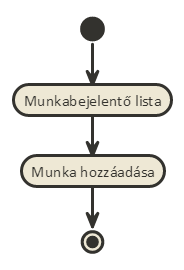
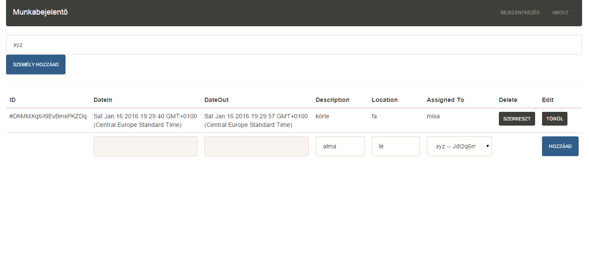
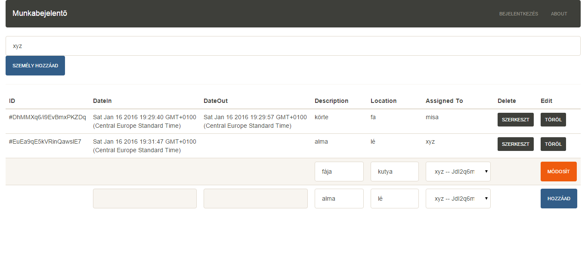
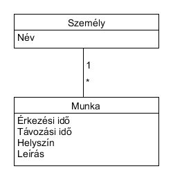

# Munkabejelentő
##Az ELTE IK Alkalmazások fejlesztése tárgy keretein belül készített 3. beadandó

______
##Követelményanalízis

#####**Funkcionális elvárások**
- Személy hozzáadása
- Munkalapot lehessen felvenni személyhez rendelve
- Munkalapokat lehessen módosítani (leírást és helyszínt, az érkezési és távozási idő automatikusan állítódik)
- Munkalapokat lehessen törölni
- Munkalapok listájának megtekintése

#####**Nem funkcionális követelmények**
- A felület jól átlátható, használata egyszerű

#####**Használatieset-modell**
######Szerepkörök:
- Vendég:
  - munkalapok listájának(részletes adatokkal) megtekintése 
  - új személy felvétele
  - új munkalap felvétele
  - munkalap szerkesztése
  - munkalap törlése

######**Használati eset diagram**

######**Új munka felvitelének pontos menete**

______
##Tervezés

#####**Architektúra terv**
######Oldaltérkép

######Végpontok

- GET  /: Főoldal
- GET  /:  Munkalapok listája
- POST /: Személy hozzáadása
- POST /: Munkalap hozzáadása
- POST /: Munkalap módosítása
- POST /: Munkalap törlése

######**Felhasználóifelület-modell**
Designterv

#####**Osztálymodell**
Adatmodell

Állapotdiagram

______
##Implementáció

______

______
##Felhasználói dokumentáció

Ajánlat a program helyes használatához:
- Munkahelyre érkezéskor program indítása
- Munka kezdése előtt közvetlenül létrehozunk egy új munkát, megadjuk a munkavégzés helyszínét
- Távozás előtt közvetlenül módosítjuk a munkát, megadjuk a leírásban az elvégzett munka jellegét

# Myapp

This README outlines the details of collaborating on this Ember application.
A short introduction of this app could easily go here.

## Prerequisites

You will need the following things properly installed on your computer.

* [Git](http://git-scm.com/)
* [Node.js](http://nodejs.org/) (with NPM)
* [Bower](http://bower.io/)
* [Ember CLI](http://www.ember-cli.com/)
* [PhantomJS](http://phantomjs.org/)

## Installation

* `git clone <repository-url>` this repository
* change into the new directory
* `npm install`q
* `bower install`

## Running / Development

* `ember server`
* Visit your app at [http://localhost:4200](http://localhost:4200).

### Code Generators

Make use of the many generators for code, try `ember help generate` for more details

### Running Tests

* `ember test`
* `ember test --server`

### Building

* `ember build` (development)
* `ember build --environment production` (production)

### Deploying

Specify what it takes to deploy your app.

## Further Reading / Useful Links

* [ember.js](http://emberjs.com/)
* [ember-cli](http://www.ember-cli.com/)
* Development Browser Extensions
  * [ember inspector for chrome](https://chrome.google.com/webstore/detail/ember-inspector/bmdblncegkenkacieihfhpjfppoconhi)
  * [ember inspector for firefox](https://addons.mozilla.org/en-US/firefox/addon/ember-inspector/)

